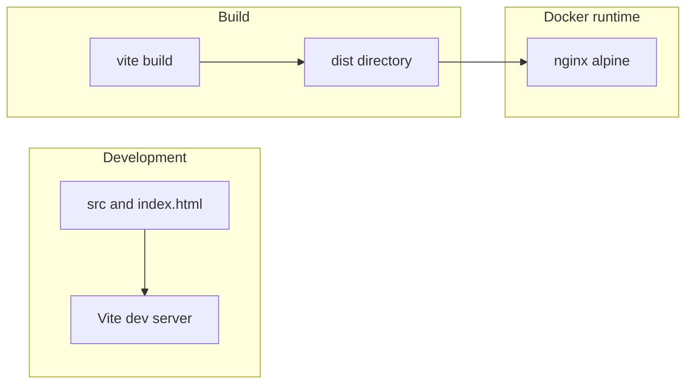

# Architecture

## Overview

Coloreval is a client-only SPA: HTML + JavaScript, built with Vite, shipped as static files. There is no application server; completed runs, in-progress drafts, and preferences persist in `localStorage`.

## Build and run

1. **Source** — `index.html` (includes a static **boot** shell and `noscript` fallback so the first paint is never an empty page), `src/**/*.js`, `src/styles/**/*.css`, assets in `public/`.
2. **Development** — `npm run dev` runs the Vite dev server with HMR.
3. **Production** — `npm run build` emits optimized **static** assets to `dist/` (self-contained HTML + JS + CSS). Vite is configured with `base: './'` so asset URLs are **relative** and the same tree can be served from the domain root, a subpath, or copied to object storage / CDN without path rewrites.
4. **Docker** — multi-stage image: Node installs dependencies and runs `vite build`; nginx serves `dist/` with SPA fallback (`try_files` → `index.html`).

## Game layer (implemented)

- **Modules** — [`../src/color.js`](../src/color.js), [`../src/run.js`](../src/run.js), [`../src/storage.js`](../src/storage.js), [`../src/console-helpers.js`](../src/console-helpers.js), [`../src/main.js`](../src/main.js): color math, run lifecycle (`ROUNDS_PER_RUN`, neutral reset between rounds), storage I/O, browser console helpers, UI + bootstrap.
- **Match %** — Euclidean distance in **linear** sRGB, mapped to 0–100 with divisor `√3` (unit cube diagonal). Same function feeds live commits and stored aggregates (`matchPercentHsv` in [`../src/color.js`](../src/color.js)).
- **Persistence keys** (see [`../src/storage.js`](../src/storage.js)):
  - `coloreval_sessions_v1` — `{ schemaVersion, sessions: [{ id, endedAt, aggregatePct, rounds[] }] }` (append on **Finish**).
  - `coloreval_draft_v1` — draft snapshot from `runToDraftSnapshot` + `schemaVersion` (save on run start, each **Next**, `pagehide` / hidden `visibilitychange`; cleared on **Finish** or new **Play**).
  - `coloreval_prefs_v1` — `{ schemaVersion, hintDismissed }`.
- **Bootstrap** — if a valid draft exists, the app opens **Play** immediately (resume by default).
- **Console helpers** — `globalThis.colorevalDev` (`clearAll`, `clearSessions`, `clearDraft`, `clearPrefs`, `keys`, `help`) from [`../src/console-helpers.js`](../src/console-helpers.js) for QA and browser agents clearing `localStorage` without DevTools UI.

## Hosting

Any static host can serve `dist/` with SPA routing support (or path-only navigation if no client-side routes). The provided Docker image is one portable option.

## Related documents

- [`manual-browser-test.md`](manual-browser-test.md) — manual browser integration test (user stories, storage reset, pass criteria for humans and agents).
