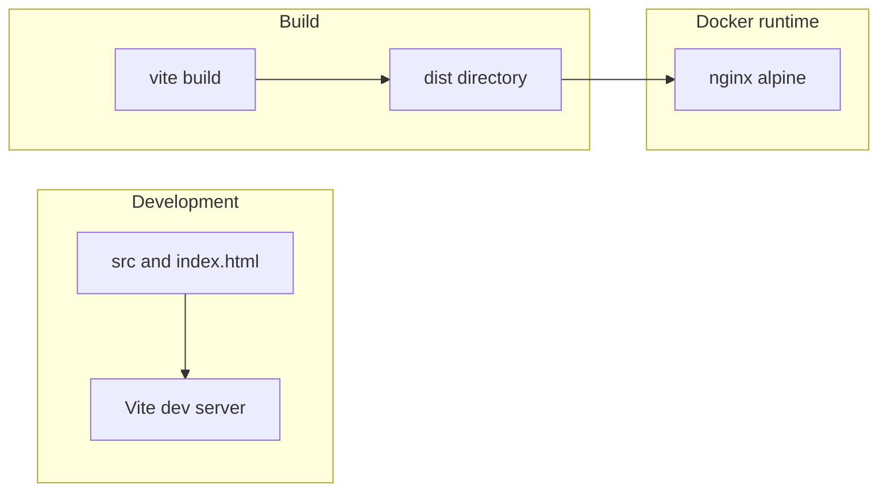

# Architecture

## Overview

Coloreval is a client-only SPA: HTML + JavaScript, built with Vite, shipped as static files. There is no application server; persistence will use the browser’s `localStorage` when the game layer exists.

## Build and run

1. **Source** — `index.html`, `src/**/*.js`, `src/styles/**/*.css`, assets in `public/`.
2. **Development** — `npm run dev` runs the Vite dev server with HMR.
3. **Production** — `npm run build` emits optimized assets to `dist/`.
4. **Docker** — multi-stage image: Node installs dependencies and runs `vite build`; nginx serves `dist/` with SPA fallback (`try_files` → `index.html`).

## Future game concerns (not implemented)

- **State** — session UI state and round progression in memory or small modules.
- **Persistence** — score history and settings in `localStorage`; key names to be defined when the feature ships.

## Hosting

Any static host can serve `dist/` with SPA routing support (or path-only navigation if no client-side routes). The provided Docker image is one portable option.
